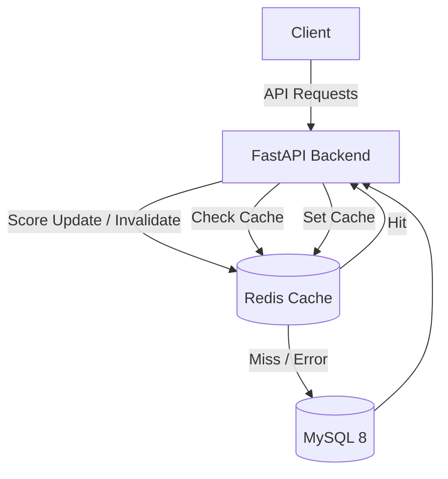

# GamePulse

GamePulse is a production-ready backend service built with FastAPI, SQLAlchemy, and MySQL 8. It supports player registration, authentication, match management, scoring, and leaderboards.

## Architecture

The system uses a layered architecture with Redis caching for performance and MySQL as the primary data store. The application is resilient to cache failures and will automatically fallback to querying the database directly.



## Features

- **Player Management**: Register and login using JWT.
- **Matches**: Create, join, and leave matches.
- **Scoring**: Update player scores within a match.
- **Leaderboard**: View top players across all matches.
- **Event Tracking**: Internal tracking of game events (registration, login, matches, scores).
- **Caching Layer**: Redis caching for leaderboards and active player statistics.
- **Structured Logging**: JSON-formatted logging for easy log aggregation with cache hit/miss statuses.

## Requirements

- Docker
- Docker Compose

## Quick Start

1. **Clone and enter the directory**:
   ```bash
   cd GamePulse
   ```

2. **Start the application**:
   ```bash
   docker compose up --build
   ```
   This will start the FastAPI backend, MySQL database, and Redis cache. The database will automatically initialize using the `schema.sql` file.

3. **Verify Health**:
   Visit [http://localhost:8000/health](http://localhost:8000/health) to ensure the service is up and connected to the database.

4. **Access the API Documentation**:
   Visit [http://localhost:8000/docs](http://localhost:8000/docs) to access the interactive Swagger UI.

## Monitoring

GamePulse exports custom metrics to Prometheus, which are visualized via Grafana. You can monitor the application by visiting:
- **Grafana Dashboard**: [http://localhost:3000](http://localhost:3000) (Login with `admin` / `admin`)
- **Prometheus UI**: [http://localhost:9090](http://localhost:9090)
- **Raw Metrics**: [http://localhost:8000/metrics](http://localhost:8000/metrics)

## Load Testing

GamePulse includes a Locust load testing suite that simulates realistic player behavior. 
To run load tests:
1. Ensure the `locust` service is running via Docker Compose.
2. Visit the Locust Web UI at [http://localhost:8089](http://localhost:8089).
3. Start the test. Test results will be automatically exported as CSV files (`stats_requests.csv`, `stats_failures.csv`, `stats_stats.csv`) in the `load_tests/` directory.

## Testing

To run the smoke tests locally, you need a Python environment with `pytest` installed:
```bash
pip install -r requirements.txt
pytest tests/
```

*(Note: The smoke tests use an in-memory SQLite database, so a running MySQL instance is not strictly necessary to run them).*
