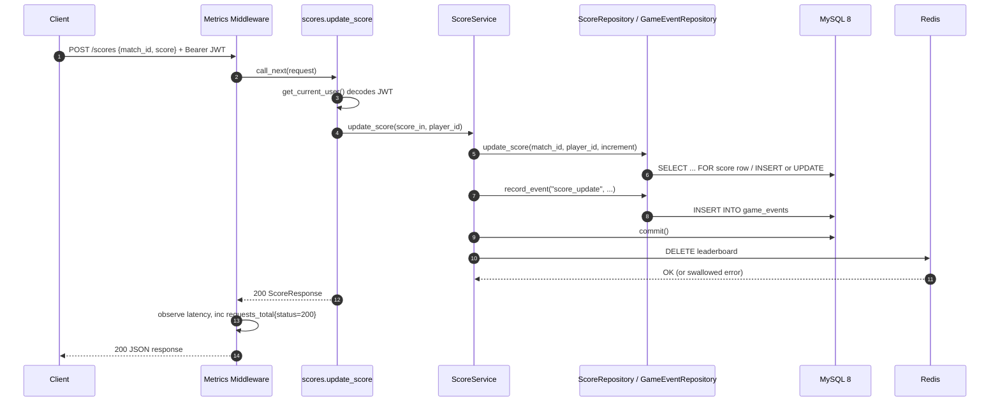

# System Architecture & Technical Design

## 1. Executive Summary

**GamePulse** is a production-style backend service for real-time multiplayer game
telemetry — player accounts, matches, scoring, and leaderboards — built on
**FastAPI + SQLAlchemy + MySQL 8**, with a **Redis** cache-aside layer for hot-path
reads and a full **Prometheus/Grafana** observability stack.

The service is designed around three non-functional goals: **cache-first reads**
for the leaderboard, **graceful degradation** when Redis or MySQL is unavailable,
and **first-class observability** (structured JSON logs + Prometheus metrics on
every request).

---

## 2. High-Level Architecture Topology

```
                                    CLIENT LAYER
                   ┌──────────────────────────────────────────────┐
                   │        Locust Load Generator (Bots)          │
                   │        REST clients / Swagger UI (/docs)     │
                   └──────────────────────┬───────────────────────┘
                                          │ HTTP/JSON (Bearer JWT)
                                          ▼
                               APPLICATION SERVER LAYER
                   ┌──────────────────────────────────────────────┐
                   │                FastAPI App (app/main.py)      │
                   │  ┌─────────────────────────────────────────┐  │
                   │  │  Metrics Middleware (per-request timer) │  │
                   │  └───────────────────┬─────────────────────┘  │
                   │                      ▼                        │
                   │  ┌─────────────────────────────────────────┐  │
                   │  │            api_router (app/api)          │  │
                   │  │  /auth  /matches  /scores  /leaderboard  │  │
                   │  │  /health  /stats  /players/me            │  │
                   │  └───────┬──────────────┬────────────┬──────┘  │
                   │          ▼              ▼            ▼         │
                   │  ┌────────────┐ ┌──────────────┐ ┌──────────┐ │
                   │  │PlayerService│ │ MatchService │ │ScoreSvc  │ │
                   │  └──────┬─────┘ └──────┬───────┘ └────┬─────┘ │
                   │         ▼              ▼               ▼      │
                   │  ┌─────────────────────────────────────────┐  │
                   │  │   Repositories (SQLAlchemy ORM layer)    │  │
                   │  │  PlayerRepo · MatchRepo · ScoreRepo ·    │  │
                   │  │  GameEventRepo                           │  │
                   │  └───────────────────┬─────────────────────┘  │
                   │                      │                        │
                   │   ┌──────────────────┼──────────────────┐     │
                   │   ▼                  ▼                  ▼     │
                   │ Redis (cache)   MySQL 8 (SoR)     /metrics     │
                   │                                   (Prometheus)│
                   └──────────────────────┬───────────────────────┘
                                          │
                   ┌──────────────────────┴───────────────────────┐
                   ▼                                              ▼
          IN-MEMORY CACHE (Redis)                     PERSISTENCE (MySQL 8)
 ┌────────────────────────────────────┐         ┌─────────────────────────────────┐
 │ • Key: leaderboard  (TTL 60s)      │         │ • players (auth, unique email)  │
 │ • Key: active_players (TTL 60s)   │         │ • matches / match_players        │
 │ • decode_responses=True, JSON val │         │ • scores (unique per match/player)│
 │ • Fail-open on RedisError/Conn err│         │ • game_events (append-only audit)│
 └────────────────────────────────────┘         └─────────────────────────────────┘
                   ▲
                   │ Scrapes GET /metrics every 5s
 ┌─────────────────┴──────────────────┐
 │      OBSERVABILITY STACK           │
 │  • Prometheus (time-series store)  │
 │  • Grafana (5-panel live dashboard)│
 └─────────────────────────────────────┘
```

---

## 3. Component Breakdown

### 3.1 API Layer (`app/api`)
- **`api_router`** aggregates six sub-routers: `auth`, `matches`, `scores`,
  `leaderboard`, `health`, `stats`, and additionally exposes `GET /players/me`
  at the root for convenience alongside `/auth/players/me`.
- **`dependencies.py`** centralizes `get_db` (per-request session with
  guaranteed `close()`) and `get_current_user` (JWT bearer decode via
  `python-jose`, 401 on any validation failure).

### 3.2 Service Layer (`app/services`)
- **`PlayerService`** — registration (uniqueness checks on username/email),
  login (bcrypt verify + JWT issuance), active-player-count with cache-aside.
- **`MatchService`** — create/join/leave, each mutation also appends a
  `GameEvent` row for audit/analytics.
- **`ScoreService`** — increments a player's score for a match, invalidates
  the `leaderboard` cache key on every write, and serves cached reads.

### 3.3 Data Layer (`app/repositories`, `app/models`)
- Repositories are thin, explicit SQLAlchemy query objects — no ORM magic
  buried in models, every query is grep-able in one file per entity.
- Models mirror `schema.sql` 1:1: `Player`, `Match`, `MatchPlayer` (composite
  PK, `ON DELETE CASCADE`), `Score` (unique `match_id, player_id`), `GameEvent`
  (`ON DELETE SET NULL` — audit rows outlive the entities they reference).

### 3.4 Caching Layer (`app/core/redis.py`)
- Deliberately minimal: `get_cache` / `set_cache` / `delete_cache`, all
  wrapped in `try/except (redis.exceptions.RedisError, ConnectionError)`.
- **Fail-open by design**: any Redis error is logged and treated as a cache
  miss — the request always falls through to MySQL rather than 500ing.

### 3.5 Observability (`app/core/metrics.py`, `app/main.py`)
- A single ASGI middleware times every request and increments
  `gamepulse_requests_total{method,endpoint,http_status}` and observes
  `gamepulse_request_duration_seconds{method,endpoint}` — the `/metrics`
  endpoint itself is excluded to avoid self-noise.
- Domain gauges/counters: `gamepulse_active_players`,
  `gamepulse_matches_created_total`, `gamepulse_score_updates_total`,
  `gamepulse_cache_hits_total` / `gamepulse_cache_misses_total`.
- Structured JSON logging (`python-json-logger`) tags every cache access with
  `CACHE_HIT` / `CACHE_MISS` / `CACHE_INVALIDATED`, enabling log-based cache
  hit-ratio analysis independent of the metrics endpoint.

---

## 4. End-to-End Request Lifecycle — `POST /scores`



---

## 5. Deployment Topology

Six Docker Compose services: `backend` (FastAPI/uvicorn, hot-reload volume
mount), `mysql:8` (schema auto-applied from `schema.sql` on first boot),
`redis:7`, `prometheus`, `grafana` (provisioned datasource + dashboard),
and `locust` (headless-capable load generator against `backend:8000`).
